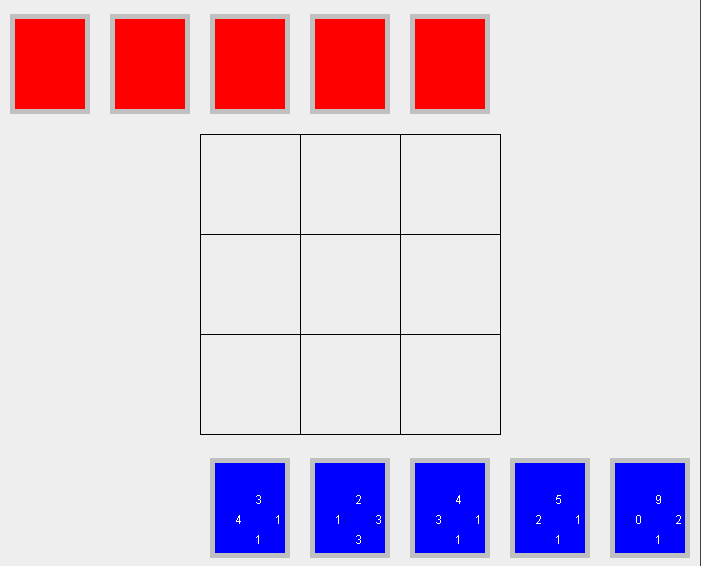
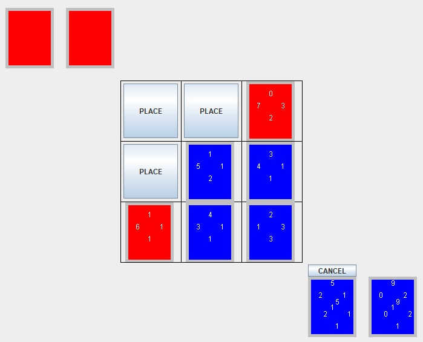

A recreation of the minigame featured many times throughout the Final Fantasy series of games, done for ICS 111.

The game is played on a 3 x 3 board, and players take turns placing down cards, which have a number assigned to each edge.

When a card is placed down, if it is touching another card, and the number on the touching side is higher than that of a card already on the board, then the card on the board gets owned by the player.

Once the board is full, whoever has the most cards wins the game.

